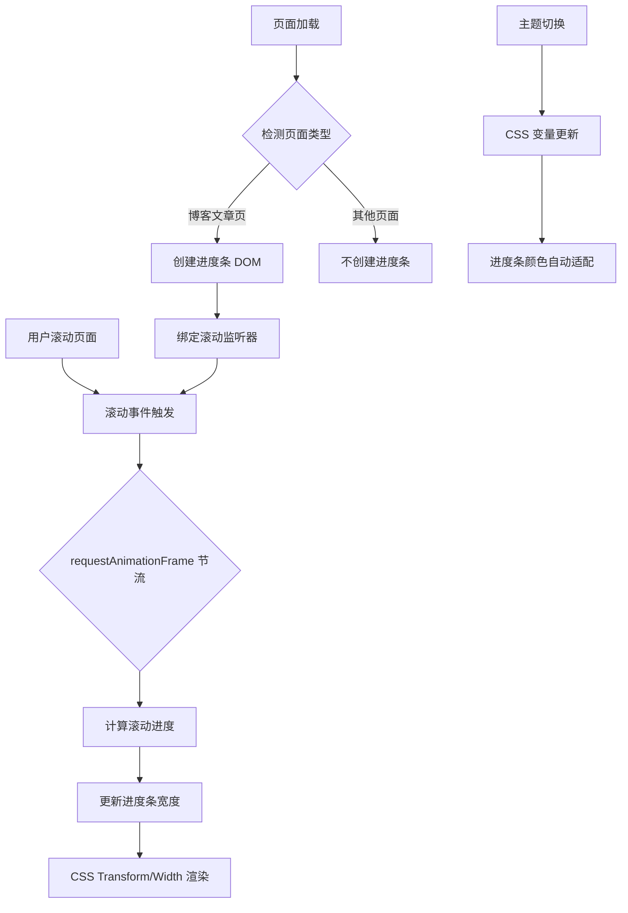
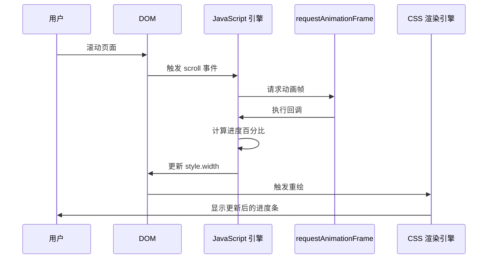

# 设计文档：阅读进度条功能

## 概述

本设计文档描述了为 Jekyll 博客添加阅读进度条功能的技术实现方案。该功能将在博客文章页面顶部显示一个细长的进度条，随用户滚动实时更新，提供视觉化的阅读进度反馈。

### 设计目标

- **视觉一致性**：完全融入现有的 Apple 风格设计语言
- **性能优化**：使用 `requestAnimationFrame` 确保 60fps 流畅体验
- **无缝集成**：与现有的 CSS 变量系统和 JavaScript 代码库完美整合
- **响应式设计**：在所有设备上提供一致的用户体验
- **零依赖**：使用原生 JavaScript，不引入外部库

### 核心特性

1. 固定在页面顶部的 3px 高度进度条
2. 使用 `--primary-color` 实现主题自适应
3. 基于滚动位置的实时进度计算
4. 仅在博客文章页面显示
5. 平滑的宽度过渡动画

---

## 架构设计

### 系统架构图



### 组件层次结构

```
document.body
└── #reading-progress-bar (动态创建)
    └── .progress-fill (内部填充元素)
```

### 数据流



---

## 组件与接口设计

### 1. HTML 结构

进度条将通过 JavaScript 动态创建，不需要修改 Jekyll 模板文件。

```html
<!-- 动态创建的进度条结构 -->
<div id="reading-progress-bar" class="reading-progress-bar">
  <div class="progress-fill"></div>
</div>
```

**设计决策**：
- 使用独立的容器元素 (`#reading-progress-bar`) 便于定位和样式控制
- 内部填充元素 (`.progress-fill`) 负责实际的宽度变化，实现更好的动画性能

### 2. CSS 样式设计

#### 2.1 进度条容器样式

```css
.reading-progress-bar {
    position: fixed;
    top: 0;
    left: 0;
    width: 100%;
    height: 3px;
    background-color: transparent;
    z-index: 9999; /* 确保在所有内容之上，但低于导航栏 (z-index: 1000) */
    pointer-events: none; /* 不阻挡用户交互 */
}
```

**设计决策**：
- `position: fixed` 确保进度条始终固定在视口顶部
- `z-index: 9999` 高于大部分内容，但考虑到导航栏的 `z-index: 1000`，实际应设置为 `1001` 以确保在导航栏之上
- `pointer-events: none` 防止进度条阻挡顶部导航栏的点击事件

#### 2.2 进度填充样式

```css
.progress-fill {
    height: 100%;
    width: 0%;
    background: linear-gradient(90deg, var(--primary-color), var(--link-hover-color));
    box-shadow: 0 0 10px rgba(0, 122, 255, 0.3);
    transition: width 0.2s ease-out, background-color 0.3s ease;
    will-change: width;
}

/* 深色模式适配 */
[data-theme="dark"] .progress-fill {
    box-shadow: 0 0 10px rgba(0, 122, 255, 0.5);
}
```

**设计决策**：
- 使用 CSS 变量 `var(--primary-color)` 和 `var(--link-hover-color)` 实现渐变效果，自动适配主题
- `transition: width 0.2s ease-out` 提供平滑的宽度变化动画
- `will-change: width` 提示浏览器优化该属性的渲染
- 轻微的 `box-shadow` 增强视觉层次感，深色模式下增加透明度以保持可见性

### 3. JavaScript 接口设计

#### 3.1 核心类：ReadingProgressBar

```javascript
class ReadingProgressBar {
    constructor() {
        this.progressBar = null;
        this.progressFill = null;
        this.ticking = false;
        this.init();
    }

    /**
     * 初始化进度条
     * 检测页面类型，仅在博客文章页创建进度条
     */
    init() {
        if (!this.isBlogPostPage()) {
            return;
        }
        this.createProgressBar();
        this.bindEvents();
    }

    /**
     * 检测是否为博客文章页
     * @returns {boolean}
     */
    isBlogPostPage() {
        const path = window.location.pathname;
        // 匹配 /blog/xxx.html 但排除 /blog/ 和 /blog/index.html
        return path.includes('/blog/') && 
               !path.endsWith('/blog/') && 
               !path.endsWith('/blog/index.html');
    }

    /**
     * 创建进度条 DOM 元素
     */
    createProgressBar() {
        this.progressBar = document.createElement('div');
        this.progressBar.id = 'reading-progress-bar';
        this.progressBar.className = 'reading-progress-bar';
        
        this.progressFill = document.createElement('div');
        this.progressFill.className = 'progress-fill';
        
        this.progressBar.appendChild(this.progressFill);
        document.body.appendChild(this.progressBar);
    }

    /**
     * 绑定滚动事件监听器
     */
    bindEvents() {
        window.addEventListener('scroll', () => this.onScroll(), { passive: true });
        // 初始化时计算一次进度
        this.updateProgress();
    }

    /**
     * 滚动事件处理器（使用 requestAnimationFrame 节流）
     */
    onScroll() {
        if (!this.ticking) {
            window.requestAnimationFrame(() => {
                this.updateProgress();
                this.ticking = false;
            });
            this.ticking = true;
        }
    }

    /**
     * 计算并更新进度条宽度
     */
    updateProgress() {
        const scrollTop = window.pageYOffset || document.documentElement.scrollTop;
        const docHeight = document.documentElement.scrollHeight;
        const winHeight = window.innerHeight;
        const scrollPercent = scrollTop / (docHeight - winHeight);
        const scrollPercentRounded = Math.round(scrollPercent * 100);
        
        this.progressFill.style.width = `${scrollPercentRounded}%`;
    }

    /**
     * 清理资源（页面卸载时调用）
     */
    destroy() {
        if (this.progressBar && this.progressBar.parentNode) {
            this.progressBar.parentNode.removeChild(this.progressBar);
        }
    }
}
```

**设计决策**：
- 使用类封装所有逻辑，便于维护和测试
- `passive: true` 选项优化滚动性能，告诉浏览器不会调用 `preventDefault()`
- `requestAnimationFrame` 节流确保更新频率不超过 60fps
- 使用 `Math.round()` 避免小数像素值导致的渲染问题

#### 3.2 集成到现有 script.js

```javascript
// 在 DOMContentLoaded 事件中初始化
document.addEventListener('DOMContentLoaded', function() {
    // ... 现有代码 ...
    
    // 初始化阅读进度条
    const readingProgressBar = new ReadingProgressBar();
    
    // 页面卸载时清理资源
    window.addEventListener('beforeunload', () => {
        readingProgressBar.destroy();
    });
});
```

---

## 数据模型

### 进度计算公式

```javascript
/**
 * 滚动进度计算
 * @param {number} scrollTop - 当前滚动距离
 * @param {number} docHeight - 文档总高度
 * @param {number} winHeight - 视口高度
 * @returns {number} 进度百分比 (0-100)
 */
function calculateProgress(scrollTop, docHeight, winHeight) {
    const scrollableHeight = docHeight - winHeight;
    if (scrollableHeight <= 0) return 0;
    
    const progress = (scrollTop / scrollableHeight) * 100;
    return Math.max(0, Math.min(100, progress)); // 限制在 0-100 范围内
}
```

**边界情况处理**：
- 当文档高度小于等于视口高度时，返回 0%（无需滚动）
- 使用 `Math.max` 和 `Math.min` 确保进度值在 0-100 范围内
- 页面顶部：`scrollTop = 0` → 进度 = 0%
- 页面底部：`scrollTop = docHeight - winHeight` → 进度 = 100%

---

## 与现有系统的集成方案

### 1. CSS 变量系统集成

进度条颜色直接使用现有的 CSS 变量：

```css
.progress-fill {
    background: linear-gradient(90deg, var(--primary-color), var(--link-hover-color));
}
```

**优势**：
- 自动适配浅色/深色主题
- 无需额外的主题切换逻辑
- 与网站整体配色保持一致

### 2. 与现有动画系统协调

现有系统使用 `0.3s ease` 作为标准过渡时间，进度条使用 `0.2s ease-out` 以提供更快速的响应感：

```css
.progress-fill {
    transition: width 0.2s ease-out, background-color 0.3s ease;
}
```

**设计决策**：
- 宽度变化使用 `0.2s` 确保跟随滚动的即时反馈
- 颜色变化使用 `0.3s` 与主题切换动画同步

### 3. 与回到顶部按钮的协同

两者都使用 `requestAnimationFrame` 优化滚动事件处理，共享相同的性能优化策略：

```javascript
// 现有的回到顶部按钮逻辑
window.addEventListener('scroll', () => {
    if (window.pageYOffset > 300) {
        backToTopButton.classList.add('show');
    }
});

// 进度条使用相同的模式
window.addEventListener('scroll', () => this.onScroll(), { passive: true });
```

### 4. 页面类型检测逻辑

复用现有的页面路径检测模式：

```javascript
// 现有代码中的页面检测示例
const isBlogPostPage = window.location.pathname.includes('/blog/');

// 进度条的页面检测（更精确）
isBlogPostPage() {
    const path = window.location.pathname;
    return path.includes('/blog/') && 
           !path.endsWith('/blog/') && 
           !path.endsWith('/blog/index.html');
}
```

---

## 性能优化策略

### 1. 滚动事件节流

使用 `requestAnimationFrame` 实现高效的滚动事件节流：

```javascript
onScroll() {
    if (!this.ticking) {
        window.requestAnimationFrame(() => {
            this.updateProgress();
            this.ticking = false;
        });
        this.ticking = true;
    }
}
```

**性能指标**：
- 更新频率：最高 60fps（约 16.67ms 一次）
- CPU 占用：与浏览器刷新率同步，避免不必要的计算
- 内存占用：单个布尔标志位，可忽略不计

### 2. CSS 渲染优化

```css
.progress-fill {
    will-change: width;
    transform: translateZ(0); /* 启用 GPU 加速 */
}
```

**优化效果**：
- `will-change: width` 提前告知浏览器该属性将频繁变化
- `transform: translateZ(0)` 创建新的合成层，使用 GPU 渲染
- 避免触发页面重排（reflow），仅触发重绘（repaint）

### 3. 事件监听器优化

```javascript
window.addEventListener('scroll', () => this.onScroll(), { passive: true });
```

**优势**：
- `passive: true` 告诉浏览器不会调用 `preventDefault()`
- 浏览器可以立即开始滚动，不需要等待 JavaScript 执行
- 提升滚动流畅度，特别是在移动设备上

### 4. DOM 操作优化

```javascript
// 仅修改 style.width，避免频繁的 DOM 查询
this.progressFill.style.width = `${scrollPercentRounded}%`;
```

**最佳实践**：
- 缓存 DOM 引用（`this.progressFill`），避免重复查询
- 仅修改单个 CSS 属性，最小化重绘范围
- 使用整数百分比值，避免亚像素渲染问题

### 5. 内存管理

```javascript
destroy() {
    if (this.progressBar && this.progressBar.parentNode) {
        this.progressBar.parentNode.removeChild(this.progressBar);
    }
}
```

**资源清理**：
- 页面卸载时移除 DOM 元素
- 防止单页应用场景下的内存泄漏
- 事件监听器会随 DOM 元素移除自动清理

---

## 错误处理

### 1. 页面类型检测失败

```javascript
isBlogPostPage() {
    try {
        const path = window.location.pathname;
        return path.includes('/blog/') && 
               !path.endsWith('/blog/') && 
               !path.endsWith('/blog/index.html');
    } catch (error) {
        console.warn('Reading Progress Bar: Failed to detect page type', error);
        return false; // 默认不显示进度条
    }
}
```

### 2. DOM 创建失败

```javascript
createProgressBar() {
    try {
        this.progressBar = document.createElement('div');
        this.progressBar.id = 'reading-progress-bar';
        this.progressBar.className = 'reading-progress-bar';
        
        this.progressFill = document.createElement('div');
        this.progressFill.className = 'progress-fill';
        
        this.progressBar.appendChild(this.progressFill);
        document.body.appendChild(this.progressBar);
    } catch (error) {
        console.error('Reading Progress Bar: Failed to create DOM elements', error);
        this.progressBar = null;
        this.progressFill = null;
    }
}
```

### 3. 滚动计算异常

```javascript
updateProgress() {
    try {
        const scrollTop = window.pageYOffset || document.documentElement.scrollTop;
        const docHeight = document.documentElement.scrollHeight;
        const winHeight = window.innerHeight;
        
        // 防御性检查
        if (!this.progressFill || docHeight <= winHeight) {
            return;
        }
        
        const scrollPercent = scrollTop / (docHeight - winHeight);
        const scrollPercentRounded = Math.max(0, Math.min(100, Math.round(scrollPercent * 100)));
        
        this.progressFill.style.width = `${scrollPercentRounded}%`;
    } catch (error) {
        console.error('Reading Progress Bar: Failed to update progress', error);
    }
}
```

---

## 测试策略

### 单元测试

由于这是一个 UI 功能，主要涉及 DOM 操作和浏览器 API，不适合使用属性测试（Property-Based Testing）。我们将采用以下测试策略：

#### 1. 页面类型检测测试

```javascript
describe('ReadingProgressBar.isBlogPostPage', () => {
    test('应在博客文章页返回 true', () => {
        // 模拟 /blog/article.html
        Object.defineProperty(window, 'location', {
            value: { pathname: '/blog/article.html' },
            writable: true
        });
        const bar = new ReadingProgressBar();
        expect(bar.isBlogPostPage()).toBe(true);
    });

    test('应在博客列表页返回 false', () => {
        Object.defineProperty(window, 'location', {
            value: { pathname: '/blog/' },
            writable: true
        });
        const bar = new ReadingProgressBar();
        expect(bar.isBlogPostPage()).toBe(false);
    });

    test('应在首页返回 false', () => {
        Object.defineProperty(window, 'location', {
            value: { pathname: '/' },
            writable: true
        });
        const bar = new ReadingProgressBar();
        expect(bar.isBlogPostPage()).toBe(false);
    });
});
```

#### 2. 进度计算测试

```javascript
describe('calculateProgress', () => {
    test('页面顶部应返回 0%', () => {
        const progress = calculateProgress(0, 2000, 800);
        expect(progress).toBe(0);
    });

    test('页面底部应返回 100%', () => {
        const progress = calculateProgress(1200, 2000, 800);
        expect(progress).toBe(100);
    });

    test('页面中间应返回正确百分比', () => {
        const progress = calculateProgress(600, 2000, 800);
        expect(progress).toBe(50);
    });

    test('文档高度小于视口高度应返回 0%', () => {
        const progress = calculateProgress(0, 500, 800);
        expect(progress).toBe(0);
    });
});
```

#### 3. DOM 创建测试

```javascript
describe('ReadingProgressBar.createProgressBar', () => {
    test('应创建正确的 DOM 结构', () => {
        document.body.innerHTML = '';
        const bar = new ReadingProgressBar();
        bar.createProgressBar();
        
        const progressBar = document.getElementById('reading-progress-bar');
        expect(progressBar).not.toBeNull();
        expect(progressBar.className).toBe('reading-progress-bar');
        
        const progressFill = progressBar.querySelector('.progress-fill');
        expect(progressFill).not.toBeNull();
    });
});
```

### 集成测试

#### 1. 滚动行为测试

```javascript
describe('ReadingProgressBar 滚动集成测试', () => {
    test('滚动时应更新进度条宽度', (done) => {
        const bar = new ReadingProgressBar();
        bar.createProgressBar();
        
        // 模拟滚动
        window.scrollTo(0, 500);
        
        // 等待 requestAnimationFrame 执行
        requestAnimationFrame(() => {
            const width = bar.progressFill.style.width;
            expect(width).not.toBe('0%');
            done();
        });
    });
});
```

#### 2. 主题切换测试

```javascript
describe('主题适配测试', () => {
    test('切换到深色模式时进度条颜色应自动更新', () => {
        const bar = new ReadingProgressBar();
        bar.createProgressBar();
        
        // 切换到深色模式
        document.documentElement.setAttribute('data-theme', 'dark');
        
        // 检查 CSS 变量是否生效
        const computedStyle = window.getComputedStyle(bar.progressFill);
        const bgColor = computedStyle.backgroundColor;
        
        // 验证颜色已更新（具体值取决于 CSS 变量定义）
        expect(bgColor).toBeTruthy();
    });
});
```

### 手动测试清单

- [ ] 在博客文章页滚动，进度条应平滑更新
- [ ] 在首页、时间轴、项目页，进度条不应显示
- [ ] 切换深色/浅色模式，进度条颜色应自动适配
- [ ] 在移动设备上测试，进度条应正常显示
- [ ] 快速滚动时，进度条应流畅跟随，无卡顿
- [ ] 页面加载时，进度条应从 0% 开始
- [ ] 滚动到页面底部，进度条应显示 100%
- [ ] 与回到顶部按钮同时使用，无冲突

### 性能测试

#### 1. 滚动性能测试

使用 Chrome DevTools Performance 面板：
- 记录滚动过程中的帧率
- 目标：保持 60fps，无明显掉帧
- 检查 JavaScript 执行时间 < 16ms

#### 2. 内存泄漏测试

- 在博客文章页停留 5 分钟，监控内存使用
- 多次切换页面，检查内存是否持续增长
- 使用 Chrome DevTools Memory 面板进行堆快照对比

---

## 实现计划

### 阶段 1：核心功能实现（优先级：高）

1. 创建 CSS 样式
2. 实现 `ReadingProgressBar` 类
3. 集成到 `script.js`
4. 页面类型检测逻辑

### 阶段 2：性能优化（优先级：高）

1. 实现 `requestAnimationFrame` 节流
2. 添加 `will-change` 和 GPU 加速
3. 优化 DOM 操作

### 阶段 3：错误处理与测试（优先级：中）

1. 添加 try-catch 错误处理
2. 编写单元测试
3. 进行集成测试

### 阶段 4：文档与优化（优先级：低）

1. 添加代码注释
2. 性能测试与调优
3. 浏览器兼容性测试

---

## 浏览器兼容性

### 支持的浏览器

- Chrome/Edge 90+
- Firefox 88+
- Safari 14+
- iOS Safari 14+
- Android Chrome 90+

### 关键 API 兼容性

| API | Chrome | Firefox | Safari | 备注 |
|-----|--------|---------|--------|------|
| `requestAnimationFrame` | 10+ | 4+ | 6+ | 全面支持 |
| `CSS Variables` | 49+ | 31+ | 9.1+ | 全面支持 |
| `will-change` | 36+ | 36+ | 9.1+ | 全面支持 |
| `passive event listeners` | 51+ | 49+ | 10+ | 全面支持 |

### 降级策略

对于不支持的浏览器：
- 进度条不显示，不影响核心阅读功能
- 使用 `try-catch` 捕获错误，静默失败
- 不显示错误提示，保持用户体验

---

## 安全性考虑

### 1. XSS 防护

- 不接受用户输入，无 XSS 风险
- 所有 DOM 操作使用 `createElement` 而非 `innerHTML`

### 2. 性能攻击防护

- 使用 `requestAnimationFrame` 限制更新频率
- 即使恶意快速滚动，也不会导致性能问题

### 3. 隐私保护

- 不收集用户数据
- 不发送网络请求
- 所有计算在客户端完成

---

## 未来扩展可能性

### 1. 可配置选项

```javascript
const readingProgressBar = new ReadingProgressBar({
    height: 3,              // 进度条高度
    color: '#007AFF',       // 自定义颜色
    showOnPages: ['/blog/'], // 显示页面
    position: 'top'         // 位置：top/bottom
});
```

### 2. 进度里程碑

在特定进度点显示标记（如 25%, 50%, 75%）：

```css
.progress-milestone {
    position: absolute;
    top: 0;
    width: 2px;
    height: 5px;
    background-color: rgba(255, 255, 255, 0.5);
}
```

### 3. 阅读时间估算

结合文章字数，显示预计剩余阅读时间：

```javascript
calculateReadingTime() {
    const wordsPerMinute = 200;
    const textContent = document.querySelector('.markdown-content').textContent;
    const wordCount = textContent.split(/\s+/).length;
    const readingTime = Math.ceil(wordCount / wordsPerMinute);
    return readingTime;
}
```

---

## 总结

本设计文档详细描述了阅读进度条功能的技术实现方案，包括：

1. **架构设计**：清晰的组件层次和数据流
2. **技术实现**：基于原生 JavaScript 和 CSS 的高性能方案
3. **系统集成**：与现有 CSS 变量和 JavaScript 代码库无缝整合
4. **性能优化**：使用 `requestAnimationFrame` 和 GPU 加速确保流畅体验
5. **测试策略**：全面的单元测试和集成测试计划

该设计完全符合 Apple 风格的设计语言，提供简洁、优雅、流畅的用户体验，同时保持高性能和良好的浏览器兼容性。
